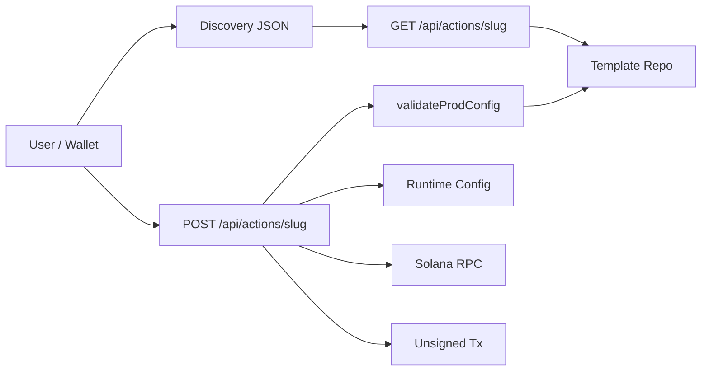

# Audit Report — `sol-blink` (Post-Fix Re-Review)

Date: 2026-04-07  
Reviewer: Droid

## Scope

Second-pass full-sweep of `sol-blink` after implementing all findings from the first audit. Covers every source file, configuration, tests, dependencies, and operational readiness.

## Executive Summary

The first-round audit findings have been addressed. Configuration now validates required env vars on the first API request in production, malformed JSON returns `400` instead of `500`, and amount parsing rejects fractional-lamport inputs. Dependencies have been patched to zero known vulnerabilities. Test coverage grew from 6 to 22 tests across two suites. One new issue was found: `.gitignore` excludes `.env.example` from version control, which means the newly created file cannot be committed.

## Architecture Overview

### High-level flow



Legend: `Template Repo` = lazy-initialized `InMemoryTemplateRepository`. `validateProdConfig` = fails fast on first request in production if env vars are missing. `Runtime Config` provides RPC URL, blockchain ID, and donation wallet.

### Main components

| Area | Files | Notes |
|---|---|---|
| App routes | `src/app/**` | Discovery endpoints, dynamic action route, home page |
| Blink engine | `src/lib/blink/action-handler.ts` | Lazy-initialized GET/POST/OPTIONS logic with production config guard |
| Config | `src/lib/blink/config.ts` | RPC URL, blockchain ID resolution (with alias support), wallet validation, production guard |
| Templates | `src/lib/blink/templates.ts`, `types.ts`, `repository.ts` | Lazy seed template factory and in-memory repository |
| Tests | `src/lib/blink/config.test.ts`, `src/app/api/actions/[slug]/route.test.ts` | Config validation + route-level tests with mocked Connection |

### Tech stack

- Next.js 16.2.2 (App Router)
- React 19
- TypeScript
- `@solana/actions`
- `@solana/web3.js`
- Vitest
- Tailwind CSS
- ESLint

## Validation Results

### Environment

- Node.js: `v24.11.1`
- npm: `11.6.2`
- OS: Windows

### Command outcomes

| Command | Result | Notes |
|---|---|---|
| `npm ci` | Passed | Clean install |
| `npm test` | Passed | 2 test files, 22 tests passed |
| `npm run lint` | Passed | No findings |
| `npm run build` | Passed | Next.js production build succeeded |
| `npm audit` | Passed | 0 vulnerabilities |
| `git status --short` | 9 changed/new files | All changes are from the audit fix implementation |

## Status of Previous Findings

### Finding 1 (was High) — Configuration fails open

**Status: RESOLVED**

- `validateProductionConfig()` now fails fast on the first API request in production if `SOLANA_RPC_URL`, `SOLANA_BLOCKCHAIN_ID`, or `SOLANA_DONATION_WALLET` are missing.
- `resolveDonationWallet()` validates the wallet as a valid public key at runtime.
- `resolveBlockchainId()` rejects unsupported values instead of silently defaulting, and supports human-readable aliases like `solana:devnet`.
- Development mode still uses Devnet defaults for local convenience.
- Lazy initialization ensures the build/static-render phase is not blocked.

### Finding 2 (was Medium) — Malformed JSON returns 500

**Status: RESOLVED**

- `postActionBySlug()` now wraps `req.json()` in a dedicated `try/catch` and returns `400` with `"Invalid JSON in request body."`.
- Covered by a new test case.

### Finding 3 (was Medium) — Amount parsing accepts fractional lamports

**Status: RESOLVED**

- `parseDonationAmount()` now validates against `/^\d+(\.\d{1,9})?$/` and checks `Math.round(parsed * LAMPORTS_PER_SOL) > 0`.
- `prepareTransaction()` uses `Math.round(amount * LAMPORTS_PER_SOL)` as a defense-in-depth measure.
- Scientific notation, negative values, and >9 decimal places are all rejected.
- Covered by three new test cases.

### Finding 4 (was Low) — Missing `.env.example`

**Status: PARTIALLY RESOLVED** (see new finding below)

- `.env.example` was created with documented variables.
- However, `.gitignore` contains `.env*` which excludes `.env.example` from git tracking.

## New Findings

### 1. Low — `.gitignore` excludes `.env.example` from version control

**Where**

- `.gitignore`

**What happens**

The `.gitignore` pattern `.env*` on line 34 matches `.env.example`, preventing it from being committed.

**Why it matters**

The new `.env.example` file and the README both depend on this file being tracked in git. Without an exclusion override, `git add .env.example` will be silently ignored.

**Recommendation**

Add an exception after the `.env*` line:

```gitignore
.env*
!.env.example
```

---

### 2. Low — Home page still contains a placeholder deploy URL

**Where**

- `src/app/page.tsx`

**What happens**

The page renders `https://your-deploy-url.vercel.app` as the Dial URL for each template card. This is a placeholder that was present before the audit and was not in scope for the fix round.

**Why it matters**

Minimal risk, but makes the deployed app look unfinished to users.

**Recommendation**

Either derive the URL from the request host or replace the placeholder with a clearly labeled instruction.

---

### 3. Info — `eslint-config-next` version lags behind `next`

**Where**

- `package.json`

**What happens**

`next` is now `^16.2.2` but `eslint-config-next` is still pinned to `16.1.6`. This is not currently causing lint failures, but the mismatch could surface as warnings in future ESLint runs.

**Recommendation**

Update `eslint-config-next` to match the `next` major.minor version.

## Test Coverage Analysis

### Current coverage (22 tests across 2 suites)

**Config tests** (`src/lib/blink/config.test.ts` -- 11 tests)

- blockchain ID resolution: alias, hash, unsupported, default
- wallet validation: valid, invalid, fallback
- production config guard: development passthrough, missing RPC URL, missing wallet, missing blockchain ID

**Route tests** (`src/app/api/actions/[slug]/route.test.ts` -- 11 tests)

- GET metadata for known slug
- OPTIONS headers
- invalid amount (zero)
- invalid payer account
- 404 on unknown slug (GET and POST)
- malformed JSON body (400)
- amount with too many decimals (400)
- scientific notation amount (400)
- valid 9-decimal-place amount (200)
- happy-path POST with mocked Connection (200 + transaction)

### Remaining gaps (lower priority)

1. RPC failure during `getLatestBlockhash` -- currently falls through to the generic 500 catch
2. Negative amount strings (e.g. `"-1"`) -- currently rejected by the regex but not explicitly tested
3. `listTemplates()` / `serializeTemplateForUi()` -- used by the static home page, not tested independently
4. Discovery endpoint response shape -- not tested

### Assessment

Coverage is now solid for the API-facing code paths. The gaps above are low-risk and mostly affect the static/informational parts of the app.

## Dependency Health

| Metric | Value |
|---|---|
| `npm ci` | Passed |
| `npm audit` vulnerabilities | 0 |
| Production deps | 5 (`@solana/actions`, `@solana/web3.js`, `next`, `react`, `react-dom`) |
| Dev deps | 9 |
| `next` version | 16.2.2 (upgraded from 16.1.6 during audit fix) |

All previously reported vulnerabilities (next, brace-expansion, flatted, picomatch, vite) have been resolved.

## Operational Notes

### 1. Lazy initialization pattern is working correctly

The API services (Connection, repository, headers) are initialized on first request, not at module import time. This means:

- `next build` succeeds without requiring env vars
- Static page generation (home page) works independently of API config
- Production config validation fires only on actual API traffic

### 2. Layout metadata is now project-specific

`src/app/layout.tsx` uses "Blink Wrapper Builder" as the title and a matching description.

### 3. `.env.example` documents all required variables

The file exists with comments explaining each variable's role and default behavior.

## Remediation Priority (remaining items)

1. Fix `.gitignore` to allow `.env.example` to be committed
2. Update `eslint-config-next` to match `next` version
3. Replace placeholder deploy URL in home page (or make it dynamic)
4. Optionally add tests for RPC failure path and discovery endpoints

## Closing Assessment

The codebase is in substantially better shape than at the start of this session. The four original findings are resolved, dependency vulnerabilities are at zero, test coverage grew from 6 to 22 tests, and the build/lint/test pipeline is fully green. The remaining items are low-severity cleanup tasks.
